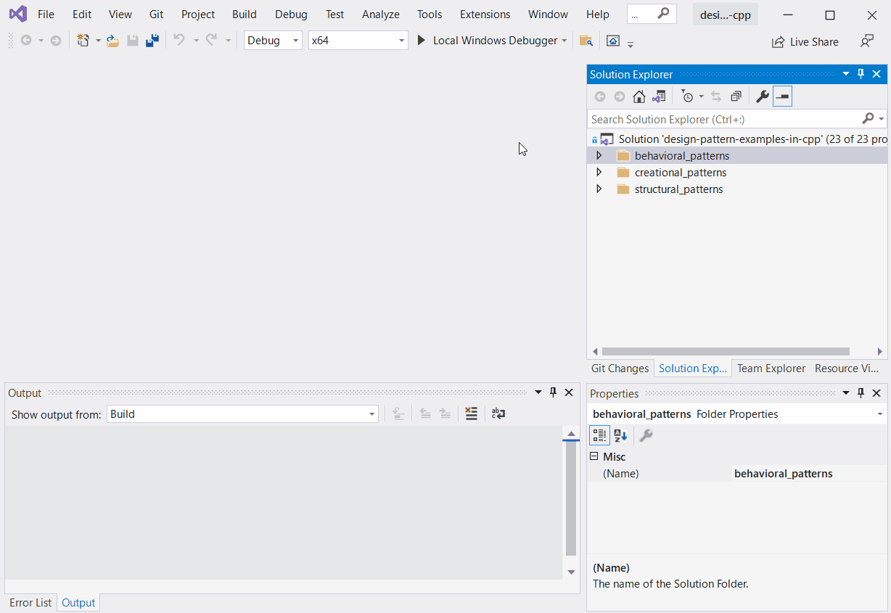

[](https://raw.githubusercontent.com/takaakit/design-pattern-examples-in-cpp/master/screenshots/DiagramMap.svg)

Design Pattern Examples in C++
===

Model and code examples of GoF Design Patterns for C++.  
This project is available for the following objectives:  

* To understand GoF Design Pattern examples in C++.
* To understand the mapping between UML model and C++ code.
* To try Model-Driven Development (MDD) using Astah and M PLUS plug-in.

> UML model example:


<a id="code-example"></a>
> C++ header file example:

```cpp:File class
// ˅

// ˄

#ifndef STRUCTURAL_PATTERNS_COMPOSITE_FILE_H_
#define STRUCTURAL_PATTERNS_COMPOSITE_FILE_H_

// ˅
#include <string>
#include "structural_patterns/composite/FileSystemElement.h"

using namespace std;

// ˄

class File : public FileSystemElement
{
	// ˅
	
	// ˄

private:

	const string name;

	const int size;

public:

	File(const string& name, const int size);

	~File();

	const string getName() const;

	const int getSize() const;

	// Print this element with the "upper_path".
	void print(const string& upper_path) const;

	// ˅
public:
	
protected:
	
private:
	File(const File&) = delete;
	File& operator=(const File&) = delete;
	
	// ˄
};

// ˅

// ˄

#endif	// STRUCTURAL_PATTERNS_COMPOSITE_FILE_H_

// ˅

// ˄
```

> C++ source file example:

```cpp:File class
// ˅
#include <iostream>
#include "structural_patterns/composite/File.h"

using namespace std;

// ˄

File::File(const string& name, const int size)
	: name(name)
	, size(size)
	// ˅
    
	// ˄
{
	// ˅
	
	// ˄
}

File::~File()
{
	// ˅
	
	// ˄
}

const string File::getName() const
{
	// ˅
	return name;
	// ˄
}

const int File::getSize() const
{
	// ˅
	return size;
	// ˄
}

void File::print(const string& upper_path) const
{
	// ˅
	cout << upper_path << "/" << toString() << endl;
	// ˄
}

// ˅

// ˄
```

Installation on Windows
------------
**UML Modeling Tool**
* Download the modeling tool [Astah](http://astah.net/download) UML or Professional, and install.  
* Download [M PLUS](https://sites.google.com/view/m-plus-plugin/download) plug-in **ver.2.2** or higher, and add it to Astah.  
  [How to add plugins to Astah](https://astahblog.com/2014/12/15/astah_plugins/)

**Visual Studio**
* Download and install [Visual Studio](https://visualstudio.microsoft.com/vs/).  
  Check "**Desktop development with C++**" and "**C++/CLI support**" when installing.
* Microsoft .NET Framework **4.7.2** or higher is required.

Usage on Windows
-----
**Code Generation from UML**
  1. Open the Astah file (model/DesignPatternExamplesInCpp.asta).
  2. Select model elements on the model browser of Astah.
  3. Click the **Generate Code** button.  
    
  The generated code has **User Code Area**. The User Code Area is the area enclosed by "˅" and "˄". Handwritten code written in the User Code Area remains after a re-generation. [View code example](#code-example).  
  For detailed usage of the tools, please see [Astah Manual](http://astah.net/manual) and [M PLUS plug-in Tips](https://sites.google.com/view/m-plus-plugin-tips).

**Build and Run**
  1. Open the solution file (design-pattern-examples-in-cpp.sln) in Visual Studio.
  2. Set up a startup project, and run it.  
       

References
----------
* Gamma, E. et al. Design Patterns: Elements of Reusable Object-Oriented Software, Addison-Wesley, 1994
* Hiroshi Yuki. Learning Design Patterns in Java [In Japanese Language], Softbank publishing, 2004

Licence
-------
This project is licensed under the Creative Commons Zero (CC0) license. The model and code are completely free to use.

[](http://creativecommons.org/publicdomain/zero/1.0/deed)
